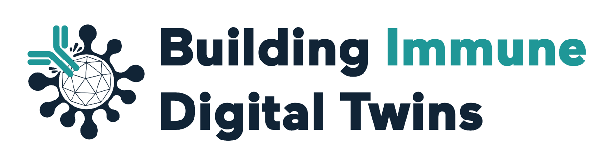

We are working hard to make this page available with all the relevant information about this exciting project! Stay tuned and don't miss our news!

Building Immune Digital Twins mini-symposium

15th of July 2024 - 9am - 12am

## Agenda

+-------+---------------------------------------------------------------------------------------------------------------------------------------------------+--------------------------------------------------+
| Time  | Title                                                                                                                                             | Speaker/coordinator                              |
+-------+---------------------------------------------------------------------------------------------------------------------------------------------------+--------------------------------------------------+
| 9:00  | Building Immune Digital Twins (overview) - discussion of our Case Statement and Milestones for the next 18 months                                 | Prof. Anna Niarakis                              |
+-------+---------------------------------------------------------------------------------------------------------------------------------------------------+--------------------------------------------------+
| 9:30  | Breakout sessions introduction                                                                                                                    | Dr. Luiz Ladeira                                 |
+-------+---------------------------------------------------------------------------------------------------------------------------------------------------+--------------------------------------------------+
| 9:45  | Breakout sessions:                                                                                                                                |                                                  |
+-------+---------------------------------------------------------------------------------------------------------------------------------------------------+--------------------------------------------------+
| 9:45  | **B1 - Data curation & repositories**                                                                                                             | Session Coordinator 1: Luiz and Sheriff remotely |
|       |                                                                                                                                                   |                                                  |
|       | Metadata curation for models and datasets (selection of models, selection of literature, selection of curation level).                            |                                                  |
|       |                                                                                                                                                   |                                                  |
|       | Minimum Metadata requirements.                                                                                                                    |                                                  |
|       |                                                                                                                                                   |                                                  |
|       | Making DTs FAIR.                                                                                                                                  |                                                  |
+-------+---------------------------------------------------------------------------------------------------------------------------------------------------+--------------------------------------------------+
| 10:15 | **B2 - Communication & dissemination**                                                                                                            | Session coordinator 2: Luiz and Ahmed            |
|       |                                                                                                                                                   |                                                  |
|       | Conferences, hackathons, workshops, training events.                                                                                              |                                                  |
+-------+---------------------------------------------------------------------------------------------------------------------------------------------------+--------------------------------------------------+
| 10:45 | **B3 - Resources and crowdsourcing pathways**                                                                                                     | Session coordinator 3: Reinhard and Anna         |
|       |                                                                                                                                                   |                                                  |
|       | List currently available resources and desirable resources not available now.                                                                     |                                                  |
|       |                                                                                                                                                   |                                                  |
|       | Identify core projects around which to mobilize the community, and discuss ways to get   started organizing people interested in working on them. |                                                  |
+-------+---------------------------------------------------------------------------------------------------------------------------------------------------+--------------------------------------------------+
| 11:15 | **B4 - VHT Roadmap IDT contribution**                                                                                                             | Session coordinator 4: Anna and Gary             |
|       |                                                                                                                                                   |                                                  |
|       | IDTs in the VHT ecosystem.                                                                                                                        |                                                  |
+-------+---------------------------------------------------------------------------------------------------------------------------------------------------+--------------------------------------------------+
| 11:45 | Summary session                                                                                                                                   | Anna & Luiz                                      |
+-------+---------------------------------------------------------------------------------------------------------------------------------------------------+--------------------------------------------------+
| 12:00 | [VHT meeting](https://www.edith-csa.eu/vht-ecosystem-meeting/) starts at noon                                                                     |                                                  |
+-------+---------------------------------------------------------------------------------------------------------------------------------------------------+--------------------------------------------------+

## Registration

Participation is free of charge. Please register [HERE](https://docs.google.com/forms/d/e/1FAIpQLSfcRC2EPMKz0XCbGoa4IQ2PKID7YiHaz5AZupJD0mvjjm0lJg/viewform?pli=1).

## Location

KIT Royal Tropical Institute\
Mauritskade 64\
1092 AD Amsterdam\
The Netherlands

## Travel

## Hotels

## Organisers

[Anna Niarakis](https://www.linkedin.com/in/anna-niarakis-58535b3/)\
[Luiz Ladeira](https://www.linkedin.com/in/luizladeira/)\
Reinhard Laubenbacher\
Gary An\
Rahuman Sheriff\
Liesbet Geris
