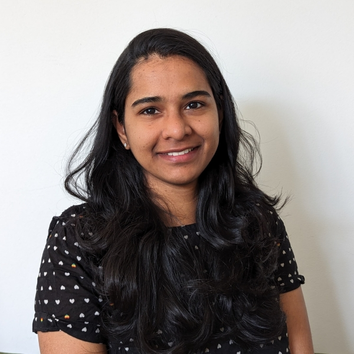

<table class="tg"><thead>
  <tr>
    <th class="tg-21ns"></th>
    <th class="tg-7t95" colspan="2">Main Chair</th>
    <th class="tg-21ns"></th>
  </tr></thead>
<tbody>
  <tr>
    <td class="tg-zv4m"></td>
    <td class="tg-7t96" colspan="2"></td>
    <td class="tg-zv4m"></td>
  </tr>
  <tr>
    <td class="tg-21ns"></td>
    <td class="tg-21ns" colspan="2">Dr Anna Niarakis</td>
    <td class="tg-21ns"></td>
  </tr>
  <tr>
    <td class="tg-zv4m"></td>
    <td class="tg-8zks" colspan="2">Full Professor of Computational Systems Biology, University of Toulouse III - Paul Sabatier</td>
    <td class="tg-zv4m"></td>
  </tr>
  <tr>
    <td class="tg-21ns"></td>
    <td class="tg-7t95" colspan="2">Co-chairs</td>
    <td class="tg-21ns"></td>
  </tr>
  <tr>
    <td class="tg-zv4m"></td>
    <td class="tg-7t96" colspan="2"></td>
    <td class="tg-zv4m"></td>
  </tr>
  <tr>
    <td class="tg-9tkx">Dr Reinhard Laubenbacher</td>
    <td class="tg-21ns" colspan="2">Dr Gary An</td>
    <td class="tg-21ns">Dr Yaron Ilan</td>
  </tr>
  <tr>
    <td class="tg-zv4m"></td>
    <td class="tg-8zks" colspan="2">
Inaugural Green and Gold Professor of Trauma and Critical Care and Vice Chair of Surgical Research, Department of Surgery, University of Vermont </td>
    <td class="tg-zv4m"></td>
  </tr>
  <tr>
   <td class="tg-21ns">Dr Liesbet Geris</td>
    <td class="tg-21ns">Dr Kristine Reiche</td>
    <td class="tg-21ns">Dr James Glazier</td>
    <td class="tg-21ns">Dr Jasmin Fisher</td>
    <td class="tg-21ns"></td>
  </tr>
  <tr>
    <td class="tg-21ns"></td>
    <td class="tg-7t95" colspan="2">Team Members</td>
    <td class="tg-21ns"></td>
  </tr>
  <tr>
    <td class="tg-21ns">Adam Knapp</td>
    <td class="tg-21ns">Ahmed Hemedan</td>
    <td class="tg-21ns">Amanda Shick</td>
    <td class="tg-21ns">Anna Niarakis</td>
  </tr>
  <tr>
    <td class="tg-21ns">Anupama Gururaj</td>
    <td class="tg-21ns">Åsmund Flobak</td>
    <td class="tg-21ns">Bernard Staumont</td>
    <td class="tg-21ns">Eirini Tsirvouli</td>
  </tr>
  <tr>
    <td class="tg-21ns">Esteban Vargas</td>
    <td class="tg-21ns">Falk Schreiber</td>
    <td class="tg-21ns">Francesco Messina</td>
    <td class="tg-21ns">Gary An</td>
  </tr>
  <tr>
    <td class="tg-21ns">Hasan Balci</td>
    <td class="tg-21ns">Jasmin Fisher</td>
    <td class="tg-21ns">Joaquin Dopazo</td>
    <td class="tg-b420">Kinza Rian</td>
  </tr>
  <tr>
    <td class="tg-b420">Kristin Reiche</td>
    <td class="tg-b420">Leonard Harris</td>
    <td class="tg-b420">Liesbet Geris</td>
    <td class="tg-b420">Lorenzo Veschini</td>
  </tr>
  <tr>
    <td class="tg-b420">Luis Sordo Vieira</td>
    <td class="tg-b420">Luis Fonseca</td>
    <td class="tg-b420">Luiz Ladeira</td>
    <td class="tg-b420">Marcella Torres</td>
  </tr>
  <tr>
    <td class="tg-b420">Marina Esteban-Medina</td>
    <td class="tg-b420">Martina Summer-Kutmon</td>
    <td class="tg-b420">Niloofar Nikaein</td>
    <td class="tg-b420">Noriko F. Hiroi</td>
  </tr>
  <tr>
    <td class="tg-b420">Philippe Moingeon</td>
    <td class="tg-b420">Reinhard Laubenbacher</td>
    <td class="tg-b420">Ryan O’Connor</td>
    <td class="tg-b420">Shiny Martis B</td>
  </tr>
  <tr>
    <td class="tg-b420">Soroush Safaei</td>
    <td class="tg-b420">Van Du Tran</td>
    <td class="tg-b420">Vincent Noël</td>
    <td class="tg-b420">Yaron Ilan</td>
  </tr>
  <tr>
<tr>
  <td class="tg-zv4m" style="text-align: center;">
    
  </td>
  <td class="tg-zv4m" style="text-align: center;">
    
  </td>
  <td class="tg-zv4m" style="text-align: center;">
    
  </td>
  <td class="tg-zv4m" style="text-align: center;">
    
  </td>
</tr>
<tr>
  <td class="tg-9tkx" style="text-align: center;">Dr. Hasan Balci, Ph.D.</td>
  <td class="tg-21ns" style="text-align: center;">Dr. Michael Blinov, Ph.D.</td>
  <td class="tg-21ns" style="text-align: center;">Dr. Laurence Calzone, Ph.D.</td>
  <td class="tg-21ns" style="text-align: center;">Dr. Sandra Ferreira, Ph.D.</td>
</tr>
<tr>
  <td class="tg-zv4m" style="text-align: center;">
    Computational Biology Branch, National Library of Medicine, NIH, Bethesda, Maryland, USA
  </td>
  <td class="tg-zv4m" style="text-align: center;">
    Center for Cell Analysis and Modeling, University of Connecticut School of Medicine, USA
  </td>
  <td class="tg-zv4m" style="text-align: center;">
    Institut Curie, Inserm U900, Mines ParisTech, PSL, Paris, France
  </td>
  <td class="tg-zv4m" style="text-align: center;">
    University of Beira Interior, Portugal
  </td>
</tr>
<tr>
  <td class="tg-zv4m" style="text-align: center;">
    
  </td>
  <td class="tg-zv4m" style="text-align: center;">
    
  </td>
  <td class="tg-zv4m" style="text-align: center;">
    
  </td>
  <td class="tg-zv4m" style="text-align: center;">
    
  </td>
</tr>
<tr>
  <td class="tg-9tkx" style="text-align: center;">Dr. Luis Fonseca, Ph.D.</td>
  <td class="tg-21ns" style="text-align: center;">Alyssa Foote, MDS</td>
  <td class="tg-21ns" style="text-align: center;">Dr. Esteban Hernandez Vargas, Ph.D.</td>
  <td class="tg-21ns" style="text-align: center;">Dr. Matthias König, Ph.D.</td>
</tr>
<tr>
  <td class="tg-zv4m" style="text-align: center;">
    Laboratory for Systems Medicine, Department of Medicine, University of Florida, Gainesville, FL, USA
  </td>
  <td class="tg-zv4m" style="text-align: center;">
    Health Data Research Associate, World Data System, Canada
  </td>
  <td class="tg-zv4m" style="text-align: center;">
    University of Idaho, USA
  </td>
  <td class="tg-zv4m" style="text-align: center;">
    Humboldt-University Berlin, Faculty of Life Science, Institute for Biology, Systems Medicine of the Liver, Germany
  </td>
</tr>
<tr>
  <td class="tg-zv4m" style="text-align: center;">
    
  </td>
  <td class="tg-zv4m" style="text-align: center;">
    
  </td>
  <td class="tg-zv4m" style="text-align: center;">
    
  </td>
  <td class="tg-zv4m" style="text-align: center;">
    
  </td>
</tr>
<tr>
  <td class="tg-9tkx" style="text-align: center;">Dr. Alexander Kulesza, Ph.D.</td>
  <td class="tg-21ns" style="text-align: center;">Dr. Luiz Ladeira, Ph.D.</td>
  <td class="tg-21ns" style="text-align: center;">Dr. Malik Sheriff, Ph.D.</td>
  <td class="tg-21ns" style="text-align: center;">Dr. Malvina Marku, Ph.D.</td>
</tr>
<tr>
  <td class="tg-zv4m" style="text-align: center;">
    ESQlabs GmbH, University Namur, Belgium
  </td>
  <td class="tg-zv4m" style="text-align: center;">
    Biomechanics Research Unit, GIGA Molecular and Computational Biology, University of Liège, Belgium
  </td>
  <td class="tg-zv4m" style="text-align: center;">
    BioModels, European Bioinformatics Institute, EMBL-EBI, UK
  </td>
  <td class="tg-zv4m" style="text-align: center;">
    Université de Toulouse, Inserm, CNRS, Université Toulouse III-Paul Sabatier, France
  </td>
</tr>
 <td class="tg-zv4m" style="text-align: center;">
    
  </td>
  <td class="tg-zv4m" style="text-align: center;">
    
  </td>
  <td class="tg-zv4m"></td>
  <td class="tg-zv4m"></td>
</tr>
<tr>
  <td class="tg-9tkx" style="text-align: center;">Dr. Shiny Martis, Ph.D.</td>
  <td class="tg-21ns" style="text-align: center;">Dr. Arnau Montagud, Ph.D.</td>
  <td class="tg-21ns" style="text-align: center;"></td>
  <td class="tg-21ns" style="text-align: center;"></td>
</tr>
<tr>
  <td class="tg-zv4m" style="text-align: center;">
    Voisin Consulting Life Sciences, France
  </td>
  <td class="tg-zv4m" style="text-align: center;">
    Institute of Interactive Systems Biology (I2SysBio), CSIC-UV, Spain
  </td>
  <td class="tg-zv4m" style="text-align: center;"></td>
  <td class="tg-zv4m" style="text-align: center;"></td>
</tbody></table>